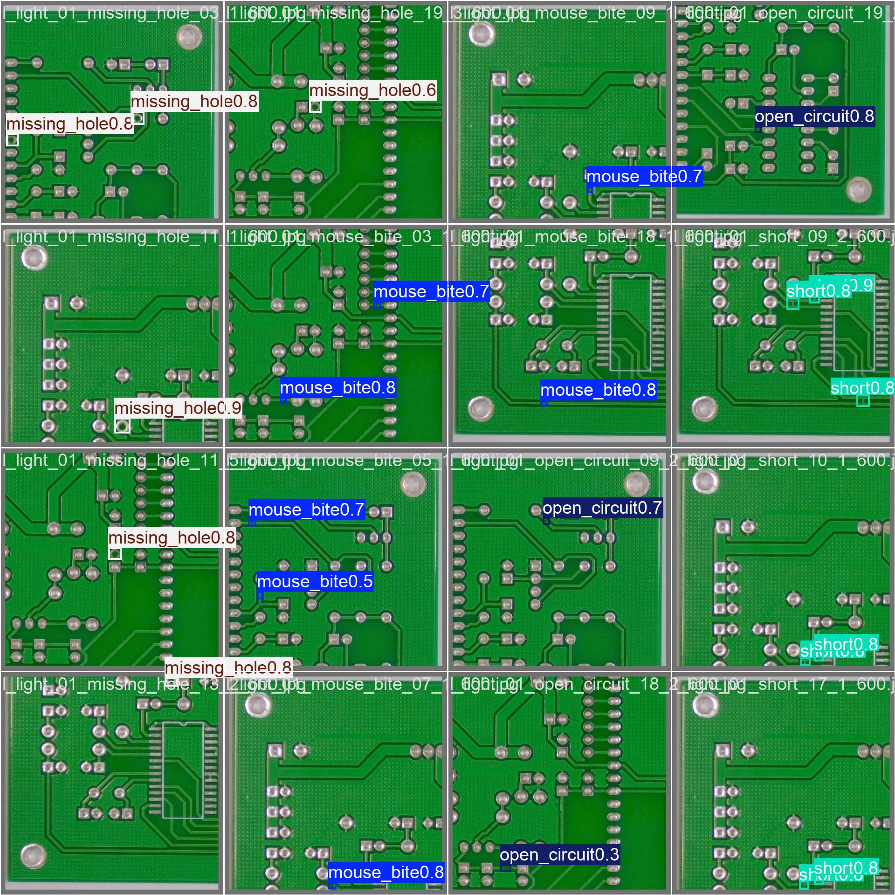
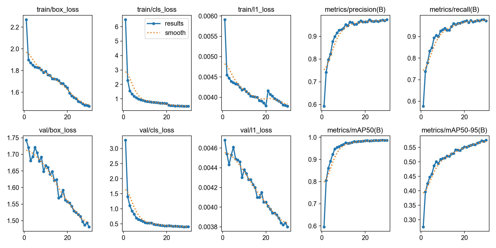
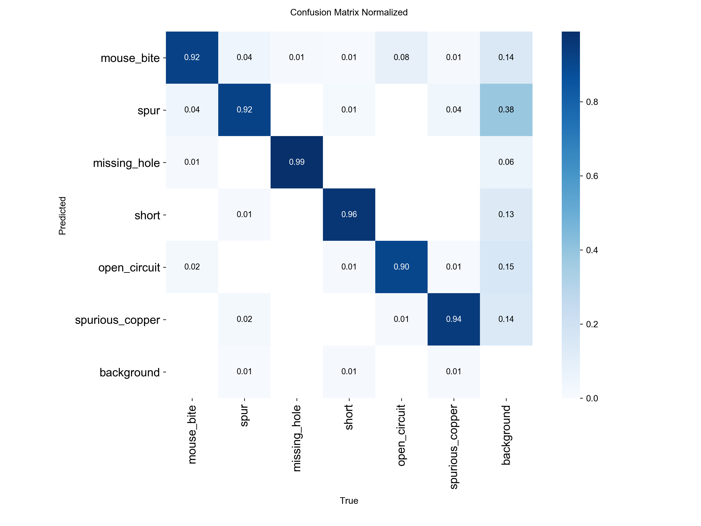
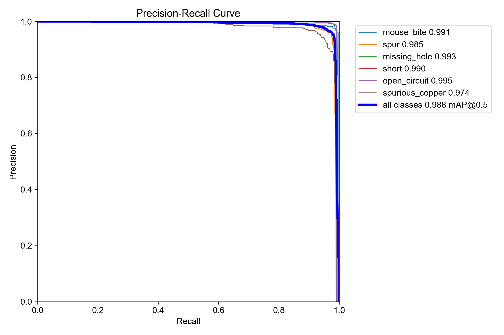

# PCB Defect Detection with YOLO

Automated optical inspection (AOI) for printed circuit boards. The model finds and classifies six common manufacturing defects in bare PCB images, using a YOLO object detector trained with [Ultralytics](https://github.com/ultralytics/ultralytics).


<p align="center">
  
</p>

---

## Highlights

- **98.8% mAP@50** on a held-out test set of 1,068 images (2,158 defect instances)
- **Six defect classes**: mouse bite, spur, missing hole, short, open circuit, spurious copper
- **Lightweight model**: YOLO26n, about 5 MB of weights, fast enough for real-time inspection
- **Full pipeline**: dataset validation and repair, training, evaluation with per-class reports, and batch inference with CSV export
- **OpenCV groundwork**: image preprocessing, edge detection, and contour analysis scripts that walk through the classical vision basics

---

## Results

Evaluated on the **test split** with `src/09_evaluate.py` (confidence and IoU thresholds are the Ultralytics defaults).

### Overall

| Metric | Score |
|---|---|
| Precision | **0.967** |
| Recall | **0.973** |
| mAP@50 | **0.988** |
| mAP@50-95 | **0.576** |

### Per class

| Class | Images | Instances | Precision | Recall | F1 | mAP@50 | mAP@50-95 |
|---|---:|---:|---:|---:|---:|---:|---:|
| mouse_bite | 168 | 332 | 0.976 | 0.979 | 0.978 | 0.991 | 0.570 |
| spur | 169 | 348 | 0.960 | 0.967 | 0.964 | 0.985 | 0.571 |
| missing_hole | 190 | 379 | 0.976 | 0.987 | 0.981 | 0.993 | 0.623 |
| short | 184 | 366 | 0.957 | 0.976 | 0.966 | 0.990 | 0.578 |
| open_circuit | 166 | 345 | 0.991 | 0.979 | 0.985 | 0.995 | 0.558 |
| spurious_copper | 191 | 388 | 0.941 | 0.950 | 0.946 | 0.974 | 0.556 |

The raw numbers are in [`src/reports/pcb_eval_test_per_class.csv`](src/reports/pcb_eval_test_per_class.csv).

> **Reading the numbers:** mAP@50 is near-perfect, so the model reliably *finds* defects. The lower mAP@50-95 reflects how hard it is to place tight boxes around defects that are only a few pixels wide. Most remaining errors are false positives on clean background. `spur` is the class most often triggered on background, so for production use it is worth tuning the confidence threshold per class.

<table>
  <tr>
    <td align="center"><b>Training curves</b></td>
    <td align="center"><b>Normalized confusion matrix (test)</b></td>
  </tr>
  <tr>
    <td></td>
    <td></td>
  </tr>
  <tr>
    <td align="center" colspan="2"><b>Precision-recall curve (test)</b></td>
  </tr>
  <tr>
    <td align="center" colspan="2"></td>
  </tr>
</table>

---

## Defect classes

| ID | Class | Description |
|---:|---|---|
| 0 | `mouse_bite` | Small bites or notches along the edge of a copper trace |
| 1 | `spur` | Unwanted thin copper protrusion extending from a trace |
| 2 | `missing_hole` | A drilled hole that should be present is missing |
| 3 | `short` | Copper bridging two traces that should be isolated |
| 4 | `open_circuit` | A break in a trace that interrupts the conductive path |
| 5 | `spurious_copper` | Leftover copper where none should exist |

---

## Project structure

```
.
├── assets/                     # Figures used in this README
├── images/                     # Output of the OpenCV preprocessing scripts
├── src/
│   ├── 01_image_basics.py      # Load an image and inspect its dimensions
│   ├── 02_image_processing.py  # Grayscale, Gaussian blur, Canny edges
│   ├── 03_contours_and_pcb_detection.py  # Draw YOLO ground-truth boxes on an image
│   ├── 04_defect_detection.py  # Contour-based region detection with OpenCV
│   ├── 05_dataset_check.py     # Validate image/label pairing and YOLO annotations
│   ├── 06_verify_filename_fix.py  # Dry run: preview label filename repairs
│   ├── 07_fix_label_filenames.py  # Apply the label filename repairs safely
│   ├── 08_train.py             # Train YOLO
│   ├── 09_evaluate.py          # Evaluate and export per-class metrics
│   ├── 10_predict.py           # Batch inference with annotated images and CSV
│   └── reports/                # Evaluation CSV reports
├── requirements.txt
└── README.md
```

Not tracked in git (see `.gitignore`): `pcb-defect-dataset/`, `runs/`, and model weights (`*.pt`).

---

## Getting started

### 1. Clone and install

```bash
git clone https://github.com/sounakkk14/pcb-defect-detection.git
cd pcb-defect-detection

python -m venv .venv
# Windows
.venv\Scripts\activate
# Linux / macOS
source .venv/bin/activate

pip install -r requirements.txt
```

> For GPU training, install the CUDA build of PyTorch that matches your driver first. See [pytorch.org](https://pytorch.org/get-started/locally/).

### 2. Prepare the dataset

Put the dataset in YOLO format at the project root:

```
pcb-defect-dataset/
├── data.yaml
├── train/{images,labels}   # 8,534 images
├── val/{images,labels}     # 1,066 images
└── test/{images,labels}    # 1,068 images
```

`data.yaml`:

```yaml
path: /absolute/path/to/pcb-defect-dataset
train: train/images
val: val/images
test: test/images

names:
  0: mouse_bite
  1: spur
  2: missing_hole
  3: short
  4: open_circuit
  5: spurious_copper
```

### 3. Validate (and repair) the dataset

Run these from the project root:

```bash
python src/05_dataset_check.py         # report mismatches and invalid annotations
python src/06_verify_filename_fix.py   # dry run of the proposed fixes
python src/07_fix_label_filenames.py   # apply the fixes
```

In this dataset, some label files ended in `_256` while their images ended in `_600`, so those images looked unlabeled. The repair script renames a label only when the mapping is one-to-one and nothing would be overwritten. If any check in a split fails, it leaves that split untouched.

---

## Usage

All scripts resolve paths relative to the project root and accept `--help`.

### Train

```bash
python src/08_train.py
```

Defaults reproduce the reported run: `yolo26n.pt`, 30 epochs, image size 640, batch 8, early-stopping patience 10. The best weights are saved to `runs/pcb_yolo_30epochs/weights/best.pt`.

```bash
# Quick check on 10% of the training data
python src/08_train.py --name smoke_test --epochs 1 --fraction 0.1

# Train on CPU
python src/08_train.py --device cpu
```

### Evaluate

```bash
python src/09_evaluate.py --split test
```

Prints overall and per-class metrics, saves plots to `runs/pcb_eval_test/`, and writes `src/reports/pcb_eval_test_per_class.csv`.

### Predict

```bash
# A whole folder
python src/10_predict.py --source path/to/images --conf 0.25

# A single image
python src/10_predict.py --source board.jpg --output runs/my_predictions
```

Annotated images are saved to the output folder, along with a `detections.csv`:

| image | class | confidence | x1 | y1 | x2 | y2 |
|---|---|---|---|---|---|---|
| board.jpg | short | 0.8731 | 412 | 188 | 437 | 209 |

---

## Training configuration

| Parameter | Value |
|---|---|
| Base model | YOLO26n (pretrained) |
| Epochs | 30 |
| Image size | 640 |
| Batch size | 8 |
| Early-stopping patience | 10 |
| Hardware | Single NVIDIA GPU (CUDA) |
| Training time | ~3.2 hours |

Environment: Python 3.11, Ultralytics 8.4, PyTorch 2.11 (CUDA 12.8), OpenCV 5.0.

---

## Roadmap

- [ ] Per-class confidence thresholds to cut `spur` false positives
- [ ] Longer training and larger model variants (s/m) to improve mAP@50-95
- [ ] Export to ONNX / TensorRT for edge deployment
- [ ] Simple web demo for drag-and-drop inspection

---

## Acknowledgements

- [Ultralytics YOLO](https://github.com/ultralytics/ultralytics) for the detection framework
- The PCB defect images follow the defect taxonomy of the [PKU-Market-PCB](https://robotics.pkusz.edu.cn/resources/dataset/) dataset from Peking University's Open Lab on Human Robot Interaction

---

## Author

**Sounak Chakraborty** · [GitHub @sounakkk14](https://github.com/sounakkk14)

If you find this project useful, consider giving it a ⭐.
